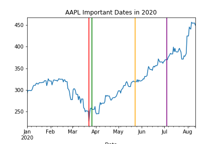
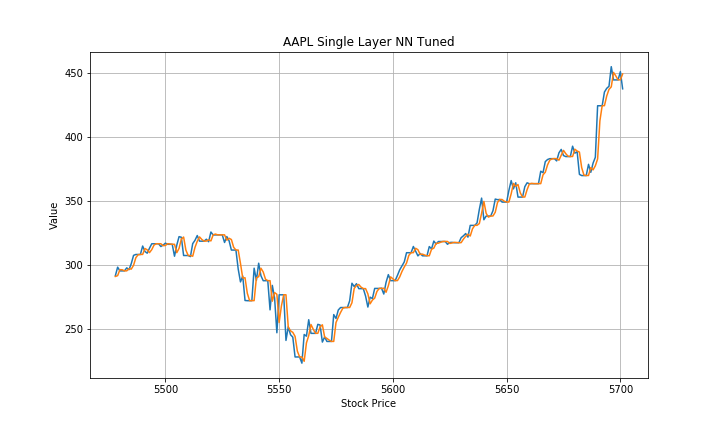

# Stock Trading MVP
By J Daniel Kim

### Overall goal
Recently, there has been a rise of retail traders in the market. The purpose of this project is to create a easy to use equity trading service that helps take emotional decisions out as a factor. Also, I want to discover if my model could profit in the 2020.
### MVP goal
Gather and explore the correct financial data. Fit a couple univariate baseline and neural network models. The models I have used is a Bivariate LSTM model, Single layer neural network, VARIMAX, and ARIMAX. Used only the Long Only strategy predicting daily closing prices.

### Stretch Goal
In addition to the MVP goal, I fitted a multivariate LSTM model, changed the trading strategy, and used three different groups of stocks. The first group is a pool of 8 selected from the top ten market cap in the S&P 500. Second group is in the top 5 most volitle stocks in 2020. Lastly, the third group is 5 stocks in my personal portfolio. My trading strategy changeed to predicting if the closing price is more than the opening. 

### Data
The data was collected from Yahoo finance. It contains historical valuation metrics, three financial statements, and  stock prices.

### Best model for fitting
- RMSE: 6.883
- Pct growth: 77.6%
- Accuracy: 59.4%
- Precision 63.8%

### EDA


```python
from IPython.display import Image
Image(filename= "AAPL_Important_Dates_in_2020.png")
```





Dates:
- 2020-03-23: S&P hit their lowest point
- 2020-03-27: Stimulus package
- 2020-05-23: Memorial Day Weekend
- 2020-07-04: July 4th


Investors hopes rise after the crash for the Apple Stock.


```python
Image(filename= "Correlation_of_Apple_Stock_Data_and_Financials.png")
```


Contains all the features I used. 

### Model Fitting
Below is fitting for the AAPL stock using a Single Layer NN Tuned. 


```python
Image(filename= "AAPL_Single_Layer_NN_Tuned.png")
```





After getting the output of the predicted opening and closing price, I binarized the output (1 for closing is greater and 0 for other). Therefore, 1 would mean to long a stock. Since I am only longing the stock, I mapped the predicted 1's to the validation to calculate the ROI. This model accounts things I misaccurately predicted as well. As mentioned before, the return on investment is 77%

### Recommendations & Future 
This basic model and research can be used to help predict whether to short or long the stock price. In the future, I want work with an attention layer and compare my model as well as explore other trading strategies.

### Sources 
- 'Using LSTM in Stock prediction and Quantitative Trading', Zhichao Zou and Zihao Qu 
- 'Time Series Prediction with LSTMs using TensorFlow 2 and Keras in Python', Venelin Valkov
- 'Sequences, Time Series and Prediction', Laurence Moroney
